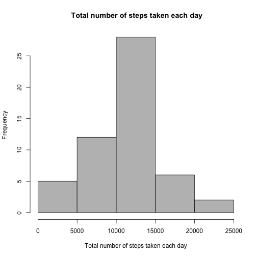
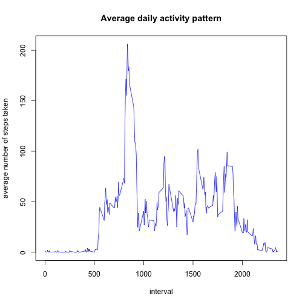
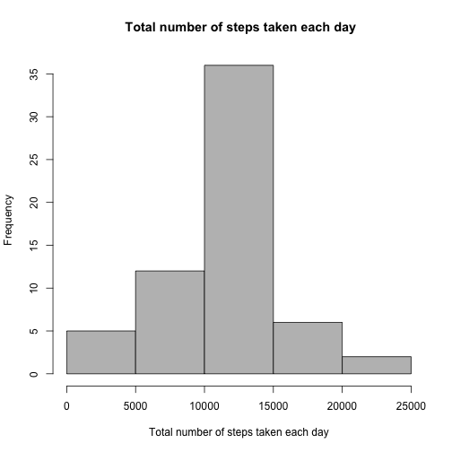
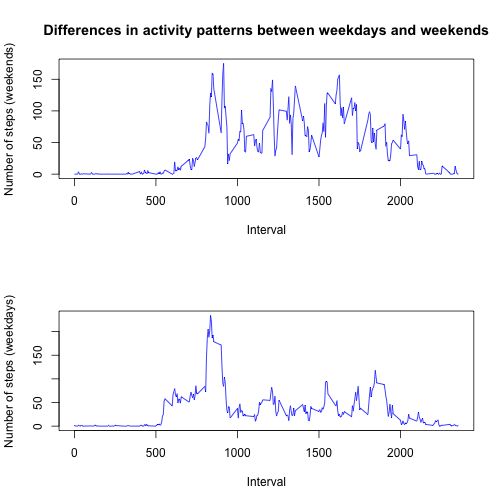

This is the Assigment 1 for Reproducible Research Course.

For caclculations and data processing we will need dplyr library.


```r
library(dplyr)
```

**Loading and preprocessing the data**

Download data from csv file

```r
original_data <- read.csv ("activity.csv", header = TRUE)
```

**What is mean total number of steps taken per day?**

Clean up data

```r
data <- na.omit(original_data)
```

Calculate the total number of steps taken each day 

```r
sum_data <- tapply (data$steps, data$date, sum)
```

Convert array to data frame


```r
sum_data<-as.data.frame(as.table(sum_data))
```

Create histogram of the total number of steps taken each day 


```r
hist(sum_data$Freq, main = " Total number of steps taken each day", 
     col = "gray", xlab = "Total number of steps taken each day")
```

 

Calculate mean of total number of steps taken each day

```r
mean_value <- mean(sum_data$Freq, na.rm = TRUE)
mean_value
```

```
## [1] 10766.19
```

Calculate median of total number of steps taken each day
Median value

```r
median_value <- median(sum_data$Freq, na.rm = TRUE)
median_value
```

```
## [1] 10765
```

**What is daily activity pattern?**

Process data for creation daily activity plot

```r
data$interval <- as.factor(data$interval)
mean_interval_data <- tapply (data$steps, data$interval, mean)
mean_interval_data <-as.data.frame(as.table(mean_interval_data))
mean_interval_data$Var1 <- as.numeric(as.character(mean_interval_data$Var1))
```


Create a plot

```r
plot(mean_interval_data$Var1, mean_interval_data$Freq, type = "l", xlab = "interval", ylab = "average number of steps taken", main = "Average daily activity pattern", col = "blue")
```

 

Calculating max value of averaged steps taken

```r
max <- max(mean_interval_data$Freq)
max
```

```
## [1] 206.1698
```

Interval with max value of averaged steps taken

```r
max_interval <- filter(mean_interval_data, Freq == max)
max_interval$Var1
```

```
## [1] 835
```


**Imputing missing values**

Total amount of `NA` in the original dirty data


```r
sum(is.na(original_data))
```

```
## [1] 2304
```

Amount of `NA` after calculating the sum of steps per each day. `NA` occurs for days with no mesuarments during all day

```r
sum(is.na(sum_data))
```

```
## [1] 8
```

Replace `NA` value with mean value 

```r
sum_data$Freq[is.na(sum_data$Freq)] <- mean_value
```

Create histogram of the total number of steps taken each day 


```r
hist(sum_data$Freq, main = " Total number of steps taken each day", 
     col = "gray", xlab = "Total number of steps taken each day")
```

 

Calculate mean value and compare it with previous calculation `mean_value`

```r
mean_value_upd <- mean(sum_data$Freq, na.rm = TRUE)
mean_value_upd
```

```
## [1] 10766.19
```
Calculated mean value is the same as the mean value calculated without replacement `NA` values.

Calculate median value and compare it with previous calculation `median_value`

```r
median_value_upd <- median(sum_data$Freq, na.rm = TRUE)
median_value_upd
```

```
## [1] 10766.19
```
Calculated median value is a little bit diffrent from value calculated without replacement `NA` values.

There is not much impact of imputing missing data on the estimates of the total daily number of steps.


**Are there differences in activity patterns between weekdays and weekends?**

Create factor column in the original cleaned data frame with values depending if selected day weekend or not.

```r
data$date <- as.Date(data$date)
data$type <- ifelse(weekdays(data$date)=="Sunday" | weekdays(data$date)=="Saturday", "weekend", "weekday")
```

Group depends on type of the week

```r
weekends <- filter (data, type == "weekend")
weekdays <- filter (data, type == "weekday")
```

Process data for plots creation

```r
weekdays$interval <- as.factor(weekdays$interval)
weekends$interval <- as.factor(weekends$interval)

weekdays_mean <- tapply (weekdays$steps, weekdays$interval, mean)
weekends_mean <- tapply (weekends$steps, weekends$interval, mean)

weekdays_mean <-as.data.frame(as.table(weekdays_mean))
weekends_mean <-as.data.frame(as.table(weekends_mean))

weekdays_mean$Var1 <- as.numeric(as.character(weekdays_mean$Var1))
weekends_mean$Var1 <- as.numeric(as.character(weekends_mean$Var1))
```

Creating a plot

```r
par(mfrow = c( 2, 1))
plot(weekends_mean$Var1, weekends_mean$Freq, xlab = "Interval", ylab = "Number of steps (weekends)", type = "l", col = "blue", main = "Differences in activity patterns between weekdays and weekends")
plot(weekdays_mean$Var1, weekdays_mean$Freq, xlab = "Interval", ylab = "Number of steps (weekdays)", type = "l", col = "blue")
```

 

People at weekends are more active than during weekdays.
